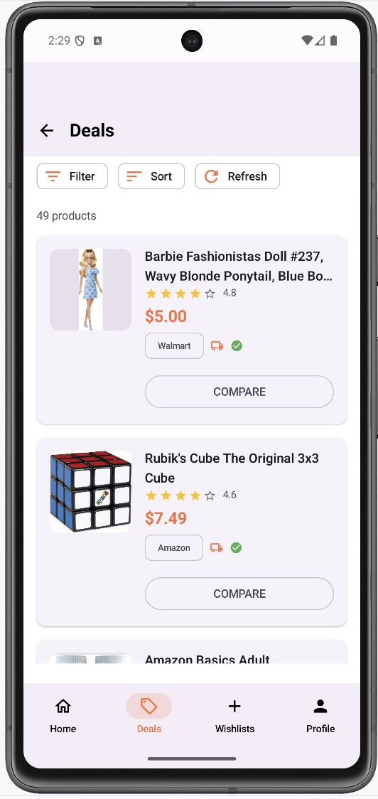

# CS501-Project-DealTracker

DealTracker is an intelligent Android application designed to help users make informed purchasing decisions by comparing real-time prices from multiple e-commerce platforms. Users can search for products, view live price updates, subscribe to price-drop alerts, and receive personalized shopping recommendations based on browsing habits. The app leverages Kotlin, Jetpack Compose, and Node.js backend to deliver a modern, responsive, and delightful shopping experience.


## Build & Run Instructions

#### Prerequisites

- Node.js 16+
- Python 3.8+
- MySQL 8.0
- Android Studio Narwhal 3
- RapidAPI Key
- Git

#### 1. Android Setup

```
git clone https://github.com/buChloeCLY/CS501-Project-DealTracker.git
cd CS501-Project-DealTracker
```

- Open DealTracker/ in Android Studio.
- Sync Gradle and wait for dependencies to resolve.
- For physical device testing, replace localhost with your computer's actual IP in:
  - Node.js Backend Client: data/remote/repository/RetrofitClient.kt

#### 2. Node.js Backend Setup

Used to serve product data and platform prices.

```
git clone https://github.com/buChloeCLY/CS501-Project-DealTracker.git
cd CS501-Project-DealTracker
cd backend
npm init -y
npm install express mysql2 axios cors dotenv node-cron openai
node server.js
```

Expected Output

```
Database connected successfully
Server running on http://localhost:8080
Daily update scheduled at 3:00 AM EST
```

Import Initial Data

```
curl -X POST http://localhost:8080/api/admin/import-initial
```

#### 3. Run Application

Run `app` in Android Studio.


## Current Features

#### Architecture & Backend

- Clean architecture following the MVVM pattern for scalability and maintainability.
- Jetpack navigation enables seamless transitions across all screens.
- ViewModel + StateFlow used for reactive, lifecycle-aware state management.
- RapidAPI integration obtains real-time data from Node.js and Flask backend services.
- Automated price monitoring updates product data daily.

#### Application Features
| Feature                          |  Notes                                                       |
|----------------------------------|-------------------------------------------------------------|
| Multi-platform price integration |  Amazon, Walmart and eBay |
| Wishlist API                     |  Alerts endpoint implemented                                 |
| Daily price update          |  One scheduled job  is designed to do it                     |
| User login & register            |  SHA-256 password hash                                       |
| Historical price chart           |  Via the Canvas library                                     | 
| Basic MVVM                       |  Architecture implemented for scalability                    |
| Price Comparison                 | Supports multiple platforms; more platforms to be added     |
| Sensor Integration               | Integrate the microphone as an input sensor for voice search                       |

#### 1. Home Screen

- Intuitive navigation shows four main screens.
- Search bar is at the top
- Category browsing with intuitive navigation to the Deals screen.
- "Deals of the Day" section provides recommendations based on user behavior.


#### 2. Deals Screen

- Fetches real-time product data from the Node.js backend API.
- Supports filtering products by price and rating.
- Periodic data updates ensure the latest deals.
- Compare button navigates to detail screen.



#### 3. Detail Screen

- Displays comprehensive product details.
- Historical price charts and trend analysis via Flask API.
- Seamless navigation to e-commerce platforms.
- Allows users to add products to their wishlist for target price tracking.


#### 4. Lists Screen

- Wishlist management
- Set target prices for automatic notifications.


#### 5. Profile Screen

- Manage user account information and preferences.
- Wishlist and browsing history management
- Font size adjustment and dark mode support
- Log out


#### 6. Login and Register Screen

- Input account and password to login
- Register new account


## Tech Stack

#### Frontend (Android)

- **Language:** Kotlin
- **UI Framework:** Jetpack Compose + Material 3
- **Architecture:** MVVM with Clean Architecture
- **Networking:** Retrofit 2 + OkHttp
- **Image Loading:** Coil
- **Async:** Kotlin Coroutines + Flow

#### Backend
- **Primary:** Node.js + Express.js
- **Data Source:** RapidAPI (Real-Time Amazon Data API)
- **Scheduler:** Everyday it will update new prices from different platforms

#### Database
- **Platform:** AWS RDS MySQL
- **Host:** database-1.cjw0amswcib4.us-east-2.rds.amazonaws.com
- **Engine:** MySQL 8.0


## Code Quality & Management
- Created separate branches for major features or development stages. Used clear commit messages to document changes.

- Follow project coding standards and use linting/formatting tools (e.g., Kotlin style guidelines).

- Use defensive programming: handle errors, timeouts, and nullability safely.


## AI Usage
- AI tools are be used to speed up development
- All AI-generated code are reviewed, tested, and verified by the developer.
