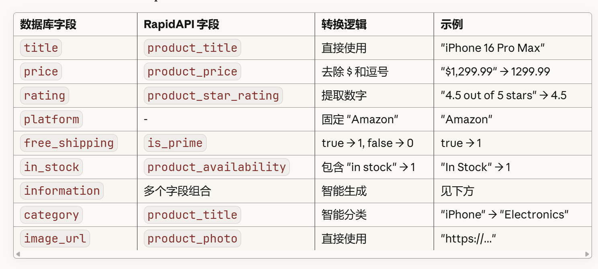

## 连接数据库指南
记得在RetrofitClient.kt里使用自己的ip和端口，并python app.py运行后端
平台：AWS-SQL
user="admin"
password="Test12345!"
database="dealtracker"
host="database-1.cjw0amswcib4.us-east-2.rds.amazonaws.com"
现在只有price表，可以插入数据，在detail页面显示
Table: price
Create Table: CREATE TABLE `price` (
`id` bigint NOT NULL AUTO_INCREMENT,
`pid` bigint DEFAULT NULL,
`price` double DEFAULT NULL,
`date` datetime DEFAULT NULL,
`platform` varchar(50) DEFAULT NULL,
`idInPlatform` varchar(100) DEFAULT NULL,
`link` varchar(500) DEFAULT NULL,
PRIMARY KEY (`id`)
) ENGINE=InnoDB AUTO_INCREMENT=24 DEFAULT CHARSET=utf8mb4 COLLATE=utf8mb4_0900_ai_ci

建立Product表：
CREATE TABLE products (
pid INT AUTO_INCREMENT PRIMARY KEY,
title VARCHAR(255) NOT NULL,
price DECIMAL(10, 2) NOT NULL,
rating FLOAT DEFAULT 0.0,
platform VARCHAR(20) NOT NULL,
free_shipping BOOLEAN DEFAULT FALSE,
in_stock BOOLEAN DEFAULT TRUE,
information TEXT,
category VARCHAR(20) NOT NULL,
image_url TEXT,
created_at TIMESTAMP DEFAULT CURRENT_TIMESTAMP,
updated_at TIMESTAMP DEFAULT CURRENT_TIMESTAMP ON UPDATE CURRENT_TIMESTAMP
) ENGINE=InnoDB DEFAULT CHARSET=utf8mb4 COLLATE=utf8mb4_unicode_ci;

11/8 建立了user表
CREATE TABLE user (
uid INT AUTO_INCREMENT PRIMARY KEY,
name VARCHAR(100) NOT NULL,
email VARCHAR(255) NOT NULL UNIQUE,
password VARCHAR(255) NOT NULL,
gender ENUM('Male', 'Female', 'Other', 'Prefer not to say') DEFAULT 'Prefer not to say',
created_at TIMESTAMP DEFAULT CURRENT_TIMESTAMP,
updated_at TIMESTAMP DEFAULT CURRENT_TIMESTAMP ON UPDATE CURRENT_TIMESTAMP,
INDEX idx_email (email)
) ENGINE=InnoDB DEFAULT CHARSET=utf8mb4;


## 后端进度
history api基本完成，price api还没开始投入用

## api部署思路：
┌─────────────────────────────────────────────────┐
│ 【步骤 1 - 一次性/定时】数据导入                    │
│                                                 │
│  Node.js 脚本 → RapidAPI → 批量导入 AWS RDS      │
│  (每天凌晨自动运行，更新价格)                      │
└─────────────────────────────────────────────────┘
↓
┌─────────────────────────────────────────────────┐
│ 【步骤 2 - 日常使用】Android App                  │
│                                                 │
│  DealsScreen                                    │
│      ↓                                          │
│  DealsViewModel                                 │
│      ↓                                          │
│  ProductRepository                              │
│      ↓                                          │
│  你的 Node.js API (http://10.0.2.2:8080)        │
│      ↓                                          │
│  AWS RDS MySQL                                  │
│      ↓                                          │
│  返回数据给 Android                              │
└─────────────────────────────────────────────────┘
com.example.dealtracker/
├── data/
│   └── remote/
│       ├── api/
│       │   └── DatabaseApiService.kt        ← 新增
│       ├── dto/
│       │   └── ProductDto.kt                ✅ 已有，不需修改
│       └── repository/
│           ├── RetrofitClient.kt            ← 新增
│           └── ProductRepositoryImpl.kt     ← 新增
├── domain/
│   └── repository/
│       └── ProductRepository.kt             ← 新增（接口）
└── ui/
└── deals/
└── viewmodel/
└── DealsViewModel.kt            ← 修改

### 改了配置，运行前记得sync一下

### 搭建 Node.js 后端（backend文件夹）：
创建项目：
npm init -y

安装依赖：
bashnpm install express mysql2 axios cors dotenv node-cron

创建 .env 文件

复制 server.js
启动服务器：
node server.js
```

应该看到：
```
✅ Database connected successfully
🚀 Server running on http://localhost:8080
⏰ Daily update scheduled at 3:00 AM

步骤 3: 首次导入 20 个产品
使用 Postman 或 curl：
bashcurl -X POST http://localhost:8080/api/admin/import-initial
等待 1-2 分钟，应该看到：
json{
"success": true,
"message": "Successfully imported 20 products",
"totalImported": 20
}

验证数据：curl http://localhost:8080/api/products

测试更新功能：curl -X POST http://localhost:8080/api/admin/update-all-prices

### 可优化的部分：每天自动更新需要一直运行server.js才行

### 还需debug的地方：图片（image_url）无显示

## 字段映射详解


## information字段详解（可精简）
generateInformation(product) 生成：

"ASIN: B0XXXXXXX • Prime Eligible • Best Seller • 15,234 ratings • Sales: 10K+ • Delivery: Tomorrow"

包含的信息：

✅ ASIN（亚马逊产品编号）
✅ Prime 会员资格
✅ Best Seller 标识
✅ Amazon's Choice 标识
✅ 评价数量
✅ 销量信息
✅ 配送信息
✅ 环保标识